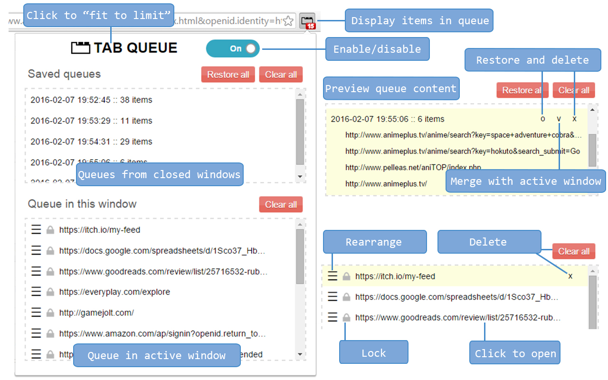
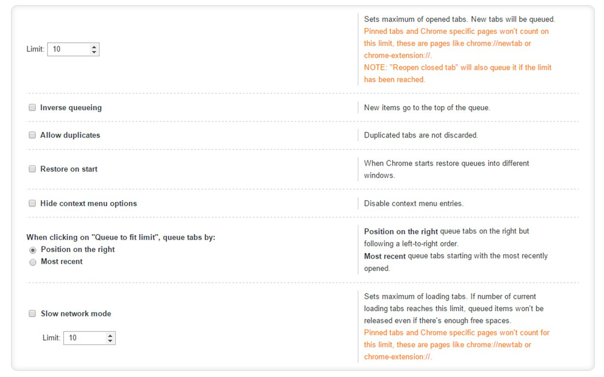
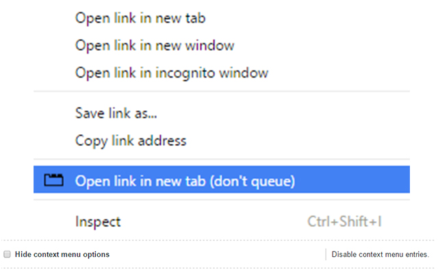

#Tabs limiter with queue#

**Tabs limiter with queue** allows you to limit the number of tabs opened in a Chrome window. New tabs exceeding the limit will be put in a queue, when a tab is closed and there's enough space in the active window, the next URL from the queue loads automatically in a new background tab.

The main purpose of this extension is to keep the browser free from a ton of background tabs that are consuming memory and CPU cycles (and battery life on laptops). It's perfect for opening links like a maniac on  Reddit, Google searches or photos/wallpaper sites.

By default tabs with URL matching Chrome internal pages won't be counted in the limit. For example chrome://extension or chrome://settings can be opened any time. This also means that you can open a new tab manually and then load any page from there, that tab won't be queued.

IMPORTANT: This extension is not meant to be used as some kind of "read later" or session manager. It's a simple tab limiter with some extra functionality.

Enjoy.

## ABOUT PERMISSIONS
This extension makes use of the minimum required permissions to provide it's functionality. 

The code is minifized to improve performance, but the original source code is public and visible from the [GitHub](https://github.com/rubenmv/chrome-extension-tabs-queue) repository, including the Gulp tasks used to obtain the final build. 

## LEGAL STUFF
Tabs Queue by Rubén Martínez is licensed as [GPLv3](http://www.gnu.org/licenses/gpl-3.0.txt). You can find the source code on [GitHub](https://github.com/rubenmv/chrome-extension-tabs-queue).  
This extension makes use of [Sortable.js](https://github.com/RubaXa/Sortable), which is distributed under the [MIT License](https://opensource.org/licenses/MIT).  
Icon from [Picol](http://www.picol.org/) is licensed under [CC BY SA 3.0](http://creativecommons.org/licenses/by-sa/3.0/).

