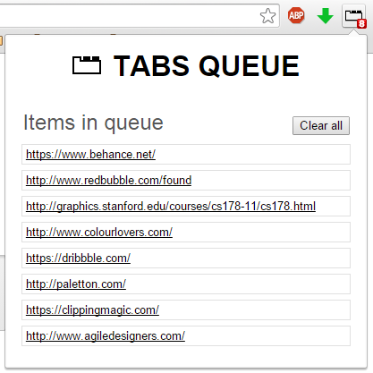

<h1>Tabs limiter with queue</h1>

<b>Tabs limiter with queue</b> allows you to limit the number of tabs opened in a Chrome window. New tabs exceeding the limit will be put in a queue, when a tab is closed and there's enough space in the active window, the next URL from the queue loads automatically in a new background tab.

The main purpose of this extension is to keep the browser free from a ton of background tabs that are consuming memory and CPU cycles (and battery). It's perfect for opening links like a maniac on  Reddit, Google searchs or photos/wallpaper sites.

By default tabs with URL matching Chrome internal pages won't be counted in the limit. For example chrome://extension or chrome://settings can be opened any time. This also means that you can open a new tab manually and then load any page from there, that tab won't be queued.

IMPORTANT: This extension is not meant to be used as some kind of "read later", where you close the browser and come back later to check the links, although it keeps the queue when you exit, but it is not recommended to use it like that.

Enjoy.

<h2>LEGAL STUFF</h2>
**Tabs limiter with queue** by <a href="https://twitter.com/rub3nmv">**Rub&eacute;n Mart&iacute;nez**</a> is licensed as <a href="http://www.gnu.org/licenses/gpl-3.0.txt">GPLv3</a>. 
Default icon made by <a href="http://www.typicons.com" title="Stephen Hutchings">Stephen Hutchings</a> from <a href="http://www.flaticon.com" title="Flaticon">www.flaticon.com</a> is licensed under <a href="http://creativecommons.org/licenses/by/3.0/" title="Creative Commons BY 3.0">CC BY 3.0</a>

